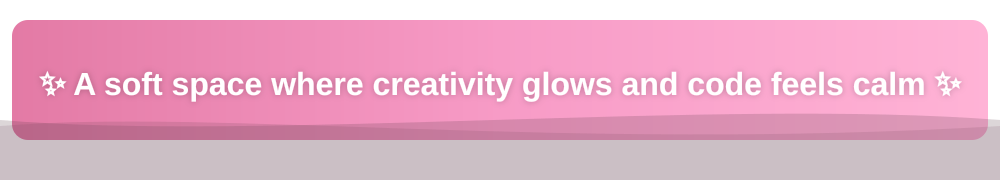

<h1 align="center">🌷 Welcome to my little corner of calm & code — I’m Samiddha ☕</h1>
<h3 align="center">Soft code • pastel vibes • glowing creativity ✨</h3>

<!-- Inline rainbow separator -->

  

<!-- Animated pink wavy banner (file-based for GitHub compatibility) -->

  

<!-- Rainbow separator -->

  

<!-- Typing animation -->

  

<!-- GIF Banner -->

  

<!-- Rainbow separator -->

  

<!-- ABOUT ME -->
 
<h3 style="font-family:'Kalam','Segoe Script','Brush Script MT',cursive;font-size:32px;text-shadow:0 0 6px #ffb3c1;">
🌺 Diary Pages of a Soft-Souled Coder
</h3>
 

✨ I blend **calm visuals** with **clean frontend code** to build soft, glowing digital experiences.  
🎨 JavaScript • React • UI/UX  
🌱 Exploring micro-interactions & pastel design  
☕ Fueled by coffee, soft playlists & late-night coding.

<!-- dreamy additions -->
✨ I create with a soft heart and an aesthetic mind  
✨ Coding feels like writing in a dream journal — gentle, expressive  
✨ Coffee is my morning spell, creativity my midnight magic  
✨ I think in pastel gradients and build in glowing pixels  
✨ My mind wanders in soft colours, my code follows quietly  
✨ I love shaping tiny details that feel like comfort  

> 🌈 “Soft code, warm heart, pastel dreams.”

  

<!-- Rainbow separator -->

  

<!-- WHAT I’M UP TO -->
 
<h3 style="font-family:'Kalam','Segoe Script','Brush Script MT',cursive;font-size:32px;text-shadow:0 0 6px #ffb3c1;">
🌸 Cloudlike Thoughts & Sparkly Execution
</h3>
 

💫 **Learning:** React, UX animations  
💞 **Collaborating on:** Aesthetic UI projects  
🎨 **Seeking help:** Smooth React animations  
💬 **Ask me about:** Pastel UI, CSS magic, Figma  

📫 Email: <a href="mailto:palsamiddha@gmail.com" style="color:#ff8fc2;text-decoration:underline;">palsamiddha@gmail.com</a>  
🌐 GitHub: <a href="https://github.com/palsamiddha-glitch" style="color:#ff8fc2;text-decoration:underline;">palsamiddha-glitch</a>  
😄 Pronouns: She  
⚡ Fun fact: Pink keyboards increase typing speed 💅

### 💖 Coding Mood Meter  
🌸 Calm: █████████░  
✨ Creative: ██████████  
☕ Coffee level: ██████░░░  
💡 Curiosity: █████████░  

<!-- Rainbow separator -->

  

<!-- TECH & TOOLS -->
 
<h3 style="font-family:'Kalam','Segoe Script','Brush Script MT',cursive;font-size:32px;text-shadow:0 0 6px #ffb3c1;">
🪽 Tools That Float Like Feathers
</h3>
 

  

<!-- Rainbow separator -->

  

<!-- FEATURED PROJECTS -->
 
<h3 style="font-family:'Kalam','Segoe Script','Brush Script MT',cursive;font-size:32px;text-shadow:0 0 6px #ffb3c1;">
<h3>🧁 Sugar-Stitched Creations</h3>

Here are some of the projects I’ve built with creativity and problem-solving:

### 🔹 Online Medical Shop  
🛒 E-commerce web application for ordering medicines and healthcare products.  
Tech Used: HTML, CSS  

### 🔹 Nexus Calc  
🧮 Futuristic neon-style scientific calculator with smooth UI and responsive design.  
Tech Used: HTML, CSS, JavaScript  

### 🔹 Cardio Chatbot  
❤️ Beginner-friendly chatbot that provides heart-health FAQs, BP classification, and lifestyle guidance.  
Tech Used: HTML  

### 🔹 CodSoft Internship Projects  
🐍 Python-based internship tasks including Advanced Calculator and other mini applications.  
Tech Used: Python

<!-- Rainbow separator -->

  

<!-- MOODBOARD -->
 
<h3 style="font-family:'Kalam','Segoe Script','Brush Script MT',cursive;font-size:32px;text-shadow:0 0 6px #ffb3c1;">
🌼 Petal Frames & Dreamy Inspirations
</h3>
 

<table align="center" cellspacing="10" cellpadding="10">
  <tr>
    <td></td>
    <td></td>
    <td></td>
  </tr>
  <tr>
    <td></td>
    <td></td>
    <td></td>
  </tr>
</table>

<!-- Rainbow separator -->

  

<!-- SPOTIFY SECTION -->
 
<h3 style="font-family:'Kalam','Segoe Script','Brush Script MT',cursive;font-size:32px;text-shadow:0 0 6px #ffb3c1;">
🎧 Melodies Floating Through My Pink Galaxy
</h3>
 

  <em style="color:#ffb3c1;">🎶 Hey Samiddha — your music vibe lives here!</em>

<!-- neon pink spotify icon (file-based) -->

  

  <svg width="120" height="70" viewBox="0 0 100 60" xmlns="http://www.w3.org/2000/svg">
    <rect x="10" y="20" width="10" height="25" rx="3" fill="#ffb3c1">
      <animate attributeName="height" values="10;30;15;40;25;10" dur="1.2s" repeatCount="indefinite"/>
      <animate attributeName="y" values="40;25;35;20;30;40" dur="1.2s" repeatCount="indefinite"/>
    </rect>
    <rect x="30" y="10" width="10" height="40" rx="3" fill="#ffcce5">
      <animate attributeName="height" values="20;35;15;40;20;20" dur="1.4s" repeatCount="indefinite"/>
      <animate attributeName="y" values="30;15;35;10;20;30" dur="1.4s" repeatCount="indefinite"/>
    </rect>
    <rect x="50" y="15" width="10" height="35" rx="3" fill="#ffd7f0">
      <animate attributeName="height" values="25;10;40;20;35;25" dur="1.1s" repeatCount="indefinite"/>
      <animate attributeName="y" values="25;40;10;30;15;25" dur="1.1s" repeatCount="indefinite"/>
    </rect>
    <rect x="70" y="20" width="10" height="25" rx="3" fill="#ffb3c1">
      <animate attributeName="height" values="10;40;30;15;25;10" dur="1.3s" repeatCount="indefinite"/>
      <animate attributeName="y" values="40;10;20;35;30;40" dur="1.3s" repeatCount="indefinite"/>
    </rect>
  </svg>

  

<!-- Rainbow separator -->

  

<!-- TROPHY SECTION -->
 
<h3 style="font-family:'Kalam','Segoe Script','Brush Script MT',cursive;font-size:32px;text-shadow:0 0 6px #ffb3c1;">

💫 Glow Metrics of My Inner Coder
</h3>
 

  
   
  

<!-- Rainbow separator -->

  

<!-- CONTRIBUTION GRAPH -->
 
<h3 style="font-family:'Kalam','Segoe Script','Brush Script MT',cursive;font-size:32px;text-shadow:0 0 6px #ffb3c1;">
🌌 Stardust Trails on My Contribution Sky
</h3>
 

  

<!-- Rainbow separator -->

  

<!-- CONNECT -->
 
<h3 style="font-family:'Kalam','Segoe Script','Brush Script MT',cursive;font-size:32px;text-shadow:0 0 6px #ffb3c1;">
💖 Come Say Hi to My Soft Corner
</h3>
 

  
  
  

<!-- Footer -->

✨ Made with pastel dreams & careful code — <strong>Samiddha</strong> 🌸

<em>🌟 Soft soul. Bright ideas. Code that glows.</em>

